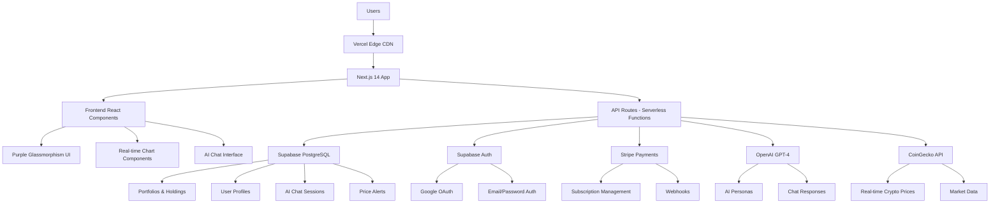
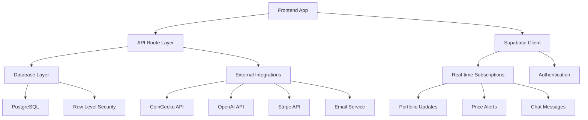
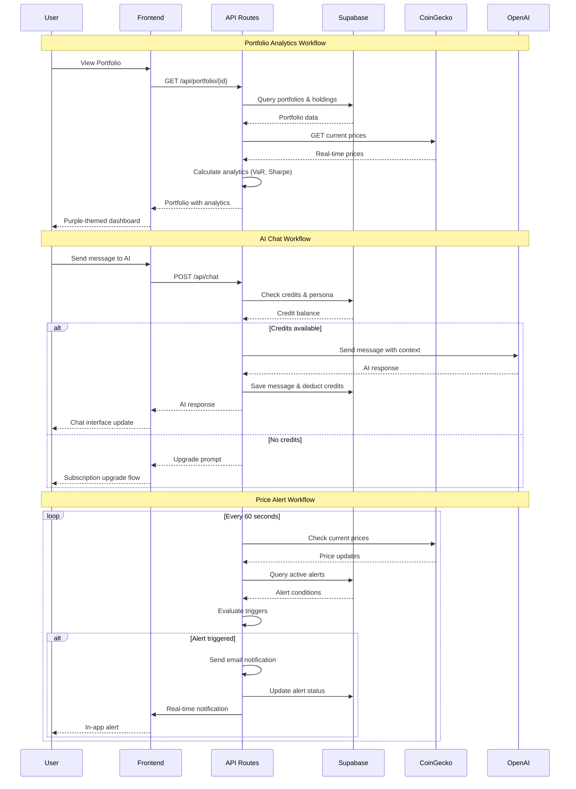
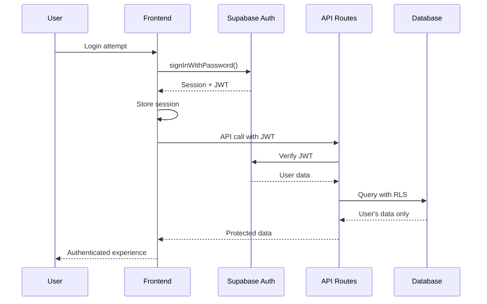
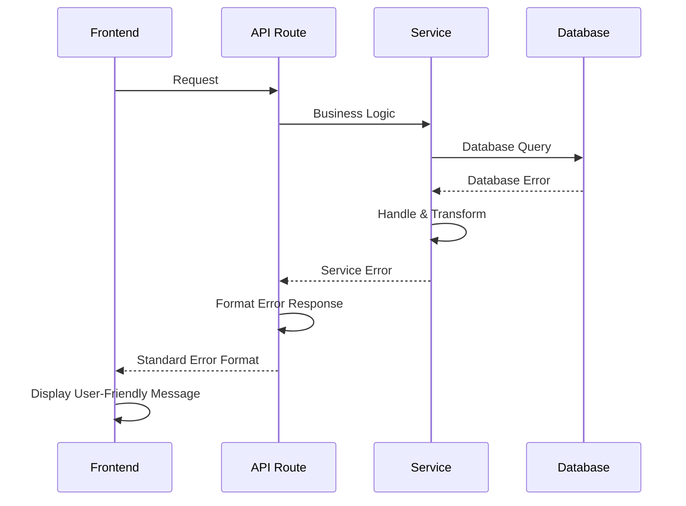

# ChainWise Fullstack Architecture Document

## Introduction

This document outlines the complete fullstack architecture for ChainWise, including backend systems, frontend implementation, and their integration. It serves as the single source of truth for AI-driven development, ensuring consistency across the entire technology stack.

This unified approach combines what would traditionally be separate backend and frontend architecture documents, streamlining the development process for modern fullstack applications where these concerns are increasingly intertwined.

### Starter Template or Existing Project

**Brownfield Enhancement** - Existing Next.js 15.5.3 project with React 19, TypeScript 5, and Tailwind CSS 4. Current implementation includes:
- ✅ **Professional Frontend**: Landing page, dashboard, AI chat interface with 3 personas
- ✅ **UI System**: shadcn/ui with glassmorphism design, responsive layouts
- ✅ **Mock Data**: Simulated user data, crypto prices, AI responses
- ❌ **Backend**: No database, authentication, or API integration
- ❌ **Real Data**: No live crypto feeds or persistent storage

**Integration Strategy**: Add Supabase backend, real OpenAI integration, and Stripe payments while preserving existing UI/UX excellence.

### Change Log
| Date | Version | Description | Author |
|------|---------|-------------|---------|
| 2024-09-18 | 1.0 | Initial fullstack architecture creation | Winston (Architect) |
| 2024-09-19 | 1.1 | Brownfield enhancement - Supabase integration patterns and existing codebase integration | Architect (BMad) |

## High Level Architecture

### Technical Summary

ChainWise employs a modern serverless Jamstack architecture deployed on Vercel with Next.js 14 as the full-stack framework. The frontend utilizes React 19 with TypeScript and a purple-themed glassmorphism design system built on shadcn/ui, while the backend leverages Next.js API routes for serverless functions. Supabase provides PostgreSQL database with real-time subscriptions, authentication, and Row Level Security, integrated with Stripe for subscription management and OpenAI for AI chat functionality. This architecture achieves PRD goals of rapid development, institutional-grade security, real-time data processing, and seamless scalability for sophisticated crypto investment analytics.

### Platform and Infrastructure Choice

**Platform:** Vercel + Supabase + Stripe
**Key Services:** Vercel Edge Functions, Supabase PostgreSQL with real-time subscriptions, Supabase Auth, Stripe payments, OpenAI GPT-4, CoinGecko API integration
**Deployment Host and Regions:** Vercel global edge network with primary deployment in US-East, edge distribution for optimal performance worldwide

### Repository Structure

**Structure:** Monorepo with Next.js 14 App Router
**Monorepo Tool:** Native Next.js structure with shared utilities
**Package Organization:** App-centric monolith with clear separation of concerns (components, api routes, shared types, utilities)

### High Level Architecture Diagram



### Architectural Patterns

- **Jamstack Architecture:** Static site generation with serverless APIs for optimal performance and scalability - _Rationale:_ Enables global edge distribution while maintaining dynamic functionality
- **Component-Based UI:** Reusable React components with TypeScript and purple glassmorphism theme - _Rationale:_ Ensures consistent design system and maintainable codebase
- **Serverless Functions:** Next.js API routes for backend logic - _Rationale:_ Automatic scaling and cost optimization for variable crypto market traffic
- **Real-time Subscriptions:** Supabase real-time for live data updates - _Rationale:_ Essential for financial data accuracy and user engagement
- **Repository Pattern:** Abstract data access through Supabase SDK - _Rationale:_ Enables testing and potential future database migration
- **API Gateway Pattern:** Centralized API routing through Next.js - _Rationale:_ Unified authentication, rate limiting, and monitoring
- **Credit-Based Usage:** Subscription tier enforcement through database constraints - _Rationale:_ Scalable freemium model with clear upgrade paths

## Brownfield Integration Strategy (v1.1)

### Current State Assessment

**Existing Implementation Quality Score: 9/10**
- ✅ **Professional Frontend**: Production-ready UI with modern React patterns
- ✅ **Design System**: Complete shadcn/ui integration with glassmorphism theme
- ✅ **TypeScript Setup**: Full type safety across components and utilities
- ✅ **Responsive Design**: Mobile-first layouts with perfect desktop experience
- ✅ **AI Chat Interface**: Fully functional with persona switching and credit system
- ❌ **Backend Infrastructure**: Missing database, authentication, real API integration

### Integration Philosophy

**Preserve Excellence, Add Functionality**
- Maintain existing UI/UX quality and design patterns
- Integrate backend services without disrupting working frontend features
- Enhance rather than replace existing mock data systems
- Follow established code patterns and component structures

### Supabase Integration Patterns

#### 1. Database Integration Strategy
```typescript
// Preserve existing interfaces, add Supabase backing
interface User {
  id: string;              // ✅ Already defined in components
  tier: 'free' | 'pro' | 'elite';  // ✅ Already used in AI chat
  credits: number;         // ✅ Already tracked in state
  // Add Supabase-specific fields
  created_at?: string;
  updated_at?: string;
  auth_id?: string;
}

// Replace mock data with Supabase queries
const getCurrentUser = async () => {
  // Replace: const mockUser = { tier: 'pro', credits: 45 }
  const { data } = await supabase.from('users').select('*').single();
  return data;
}
```

#### 2. Authentication Integration
```typescript
// Wrap existing components with auth state
export default function DashboardLayout({ children }) {
  const { user, loading } = useSupabaseAuth();

  if (loading) return <DashboardSkeleton />; // ✅ Add loading states
  if (!user) return <AuthRequired />;        // ✅ Add auth guards

  return (
    <SidebarProvider>  {/* ✅ Keep existing layout */}
      {children}
    </SidebarProvider>
  );
}
```

#### 3. Real-time Data Enhancement
```typescript
// Enhance existing components with live data
const PortfolioValue = () => {
  const [value, setValue] = useState(54750); // ✅ Keep existing state pattern

  useEffect(() => {
    // Replace mock data with real-time subscription
    const subscription = supabase
      .channel('portfolio_updates')
      .on('postgres_changes', { event: '*', schema: 'public', table: 'portfolios' },
          (payload) => setValue(payload.new.total_value))
      .subscribe();

    return () => subscription.unsubscribe();
  }, []);

  return (
    <Card className="relative overflow-hidden border-0 bg-gradient-to-br from-blue-50 to-blue-100">
      {/* ✅ Keep existing beautiful UI */}
    </Card>
  );
}
```

### AI Integration Enhancement

#### Replace Mock Responses with OpenAI
```typescript
// Current: Mock response arrays
const generateMockResponse = (persona: string) => {
  return mockResponses[persona][Math.floor(Math.random() * mockResponses[persona].length)];
}

// Enhanced: Real OpenAI integration
const generateAIResponse = async (message: string, persona: PersonaType) => {
  const systemPrompt = getPersonaPrompt(persona);
  const response = await openai.chat.completions.create({
    model: 'gpt-4',
    messages: [
      { role: 'system', content: systemPrompt },
      { role: 'user', content: message }
    ]
  });
  return response.choices[0].message.content;
}
```

### Missing Pages Implementation Strategy

#### 1. Portfolio Management Page
- **Reuse Pattern**: Copy dashboard layout and card components
- **Add Functionality**: CRUD operations with Supabase integration
- **Enhance UI**: Portfolio creation/editing forms with existing design system

#### 2. Market Analysis Page
- **Reuse Pattern**: Dashboard chart components and stat cards
- **Add Functionality**: Live CoinGecko API integration
- **Enhance UI**: Advanced charting with Recharts (already installed)

#### 3. Trading Interface
- **Reuse Pattern**: AI chat interface layout and interaction patterns
- **Add Functionality**: Trading simulation and order management
- **Enhance UI**: Trading forms with existing button and input components

#### 4. Settings & Profile Pages
- **Reuse Pattern**: Dashboard sidebar and card layouts
- **Add Functionality**: User preferences and subscription management
- **Enhance UI**: Form components with validation and dark theme switching

### Progressive Enhancement Approach

#### Phase 1: Backend Foundation (Week 1-2)
1. Supabase project setup and database schema
2. Authentication integration with existing components
3. Replace mock user data with real Supabase queries

#### Phase 2: Core Page Implementation (Week 3-4)
1. Portfolio Management with real data persistence
2. Market Analysis with live crypto feeds
3. Enhanced dark theme system across all pages

#### Phase 3: Advanced Features (Week 5-6)
1. Real OpenAI integration for AI chat
2. Stripe payment integration for subscriptions
3. Trading interface and social features

### Risk Mitigation

**Preserve Working Features**
- Keep existing AI chat functional during OpenAI migration
- Maintain dashboard performance during backend integration
- Preserve design system consistency across new pages

**Incremental Rollout**
- Feature flags for new backend services
- Gradual migration from mock to real data
- Fallback mechanisms for external API failures

## Tech Stack

### Technology Stack Table

| Category | Technology | Version | Purpose | Rationale |
|----------|------------|---------|---------|-----------|
| Frontend Language | TypeScript | 5.7+ | Type-safe frontend development | Prevents runtime errors in financial calculations |
| Frontend Framework | Next.js 14 | 14.2+ | Full-stack React framework with App Router | SSR/SSG for SEO, API routes for backend, optimal DX |
| UI Component Library | shadcn/ui | Latest | Purple-themed glassmorphism design system | Consistent, accessible components with custom theming |
| State Management | React Context | Built-in | Global state for auth and subscriptions | Simple, built-in solution adequate for app complexity |
| Backend Language | TypeScript | 5.7+ | Type-safe backend development | Shared types between frontend/backend |
| Backend Framework | Next.js API Routes | 14.2+ | Serverless backend functions | Seamless frontend/backend integration |
| API Style | REST | - | HTTP-based API communication | Simple, well-understood for financial data |
| Database | Supabase PostgreSQL | Latest | Primary data store with real-time capabilities | ACID compliance, real-time subscriptions, RLS |
| Cache | Supabase built-in | - | Query result caching | Integrated solution with database |
| File Storage | Vercel static assets | - | Static asset hosting | Integrated with deployment platform |
| Authentication | Supabase Auth | Latest | User authentication and authorization | OAuth integration, JWT tokens, RLS policies |
| Frontend Testing | Jest + React Testing Library | Latest | Component and utility testing | Industry standard for React applications |
| Backend Testing | Jest | Latest | API route and service testing | Consistent testing framework across stack |
| E2E Testing | Playwright | 1.55+ | End-to-end user flow testing | Crypto trading requires comprehensive E2E validation |
| Build Tool | Next.js | 14.2+ | Integrated build system | Optimized for React and serverless deployment |
| Bundler | Turbopack | Built-in | Fast development builds | Faster than Webpack for development |
| IaC Tool | Vercel CLI | Latest | Infrastructure deployment | Integrated with platform choice |
| CI/CD | GitHub Actions | - | Automated testing and deployment | Free for public repos, integrates with Vercel |
| Monitoring | Vercel Analytics | - | Performance and error monitoring | Integrated monitoring solution |
| Logging | Vercel Logs | - | Centralized application logging | Platform-integrated logging |
| CSS Framework | Tailwind CSS | 4.0+ | Utility-first styling with purple theme | Rapid UI development with custom design system |

## Data Models

### User

**Purpose:** Core user entity with authentication, subscription, and credit management

**Key Attributes:**
- id: string (UUID) - Primary identifier from Supabase Auth
- email: string - User's email address for communication
- created_at: timestamp - Account creation date
- subscription_tier: enum - Current subscription level (free, pro, elite)
- credits_balance: number - Remaining AI chat credits
- last_credit_refresh: timestamp - Last monthly credit allocation

#### TypeScript Interface

```typescript
interface User {
  id: string;
  email: string;
  created_at: string;
  subscription_tier: 'free' | 'pro' | 'elite';
  credits_balance: number;
  last_credit_refresh: string | null;
  total_points?: number;
  updated_at: string;
}
```

#### Relationships
- One to many with Portfolio
- One to many with AiChatSession
- One to many with UserAlert
- One to one with Subscription

### Portfolio

**Purpose:** Container for crypto holdings with performance tracking and analytics

**Key Attributes:**
- id: string (UUID) - Primary identifier
- user_id: string - Foreign key to User
- name: string - User-defined portfolio name
- description: string - Optional portfolio description
- is_default: boolean - Primary portfolio flag
- total_value_usd: number - Current total portfolio value
- total_cost_usd: number - Total cost basis
- created_at: timestamp - Portfolio creation date

#### TypeScript Interface

```typescript
interface Portfolio {
  id: string;
  user_id: string;
  name: string;
  description?: string;
  is_default: boolean;
  total_value_usd: number;
  total_cost_usd: number;
  created_at: string;
  updated_at: string;
  last_updated: string;
  deleted_at?: string;
}
```

#### Relationships
- Many to one with User
- One to many with PortfolioHolding

### PortfolioHolding

**Purpose:** Individual cryptocurrency positions within portfolios with purchase tracking

**Key Attributes:**
- id: string (UUID) - Primary identifier
- portfolio_id: string - Foreign key to Portfolio
- crypto_id: string - CoinGecko crypto identifier
- symbol: string - Cryptocurrency symbol (BTC, ETH, etc.)
- amount: number - Quantity held
- average_purchase_price_usd: number - Average cost basis
- current_price_usd: number - Latest market price
- current_value_usd: number - Current market value
- profit_loss_usd: number - Unrealized P&L

#### TypeScript Interface

```typescript
interface PortfolioHolding {
  id: string;
  portfolio_id: string;
  crypto_id: string;
  symbol: string;
  name: string;
  amount: number;
  average_purchase_price_usd: number;
  current_price_usd: number;
  current_value_usd: number;
  cost_basis_usd: number;
  profit_loss_usd: number;
  profit_loss_percentage: number;
  first_purchase_date: string;
  created_at: string;
  updated_at: string;
  last_updated: string;
}
```

#### Relationships
- Many to one with Portfolio

### AiChatSession

**Purpose:** AI conversation sessions with persona tracking and credit usage

**Key Attributes:**
- id: string (UUID) - Primary identifier
- user_id: string - Foreign key to User
- persona: enum - AI persona type (buddy, professor, trader)
- title: string - Auto-generated session title
- is_active: boolean - Current session flag
- created_at: timestamp - Session start time

#### TypeScript Interface

```typescript
interface AiChatSession {
  id: string;
  user_id: string;
  persona: 'buddy' | 'professor' | 'trader';
  title: string;
  is_active: boolean;
  created_at: string;
  updated_at: string;
}
```

#### Relationships
- Many to one with User
- One to many with AiChatMessage

### UserAlert

**Purpose:** Price monitoring alerts with notification preferences and trigger tracking

**Key Attributes:**
- id: string (UUID) - Primary identifier
- user_id: string - Foreign key to User
- crypto_id: string - CoinGecko crypto identifier
- symbol: string - Cryptocurrency symbol
- alert_type: enum - Alert condition type (price_above, price_below, percent_change)
- target_price: number - Price threshold
- percentage_threshold: number - Percentage change threshold
- is_active: boolean - Alert enabled flag
- is_triggered: boolean - Alert fired flag

#### TypeScript Interface

```typescript
interface UserAlert {
  id: string;
  user_id: string;
  crypto_id: string;
  symbol: string;
  alert_type: 'price_above' | 'price_below' | 'percent_change';
  target_price?: number;
  percentage_threshold?: number;
  notification_method: 'email' | 'in_app' | 'both';
  is_active: boolean;
  is_triggered: boolean;
  triggered_at?: string;
  message?: string;
  created_at: string;
  updated_at: string;
}
```

#### Relationships
- Many to one with User

## API Specification

### REST API Specification

```yaml
openapi: 3.0.0
info:
  title: ChainWise API
  version: 1.0.0
  description: Comprehensive crypto portfolio management and AI-powered investment guidance
servers:
  - url: https://chainwise.vercel.app/api
    description: Production API server

paths:
  /auth/user:
    get:
      summary: Get current user profile
      security:
        - BearerAuth: []
      responses:
        '200':
          description: User profile data
        '401':
          description: Unauthorized

  /portfolio:
    get:
      summary: Get user portfolios
      security:
        - BearerAuth: []
      responses:
        '200':
          description: List of user portfolios
    post:
      summary: Create new portfolio
      security:
        - BearerAuth: []
      requestBody:
        required: true
        content:
          application/json:
            schema:
              type: object
              properties:
                name:
                  type: string
                description:
                  type: string

  /portfolio/{id}/holdings:
    get:
      summary: Get portfolio holdings
      parameters:
        - name: id
          in: path
          required: true
          schema:
            type: string
    post:
      summary: Add holding to portfolio
      requestBody:
        required: true
        content:
          application/json:
            schema:
              type: object
              properties:
                crypto_id:
                  type: string
                symbol:
                  type: string
                amount:
                  type: number
                purchase_price_usd:
                  type: number

  /portfolio/{id}/analytics:
    get:
      summary: Get portfolio analytics (VaR, Sharpe Ratio, etc.)
      parameters:
        - name: id
          in: path
          required: true
          schema:
            type: string

  /chat:
    get:
      summary: Get chat sessions
      security:
        - BearerAuth: []
    post:
      summary: Send message to AI
      security:
        - BearerAuth: []
      requestBody:
        required: true
        content:
          application/json:
            schema:
              type: object
              properties:
                session_id:
                  type: string
                persona:
                  type: string
                  enum: [buddy, professor, trader]
                message:
                  type: string

  /alerts:
    get:
      summary: Get user alerts
      security:
        - BearerAuth: []
    post:
      summary: Create price alert
      security:
        - BearerAuth: []
      requestBody:
        required: true
        content:
          application/json:
            schema:
              type: object
              properties:
                crypto_id:
                  type: string
                alert_type:
                  type: string
                target_price:
                  type: number

  /stripe/checkout:
    post:
      summary: Create subscription checkout session
      security:
        - BearerAuth: []
      requestBody:
        required: true
        content:
          application/json:
            schema:
              type: object
              properties:
                tier:
                  type: string
                  enum: [pro, elite]

components:
  securitySchemes:
    BearerAuth:
      type: http
      scheme: bearer
      bearerFormat: JWT
```

## Components

### Frontend Application (Next.js)

**Responsibility:** User interface, state management, and client-side logic for crypto portfolio management with purple glassmorphism design

**Key Interfaces:**
- React component tree with TypeScript
- Supabase client for real-time data
- API route communication layer

**Dependencies:** Supabase client, shadcn/ui components, Recharts, Tailwind CSS

**Technology Stack:** Next.js 14, React 19, TypeScript, Tailwind CSS with purple theme, shadcn/ui

### API Route Layer (Serverless Functions)

**Responsibility:** Backend business logic, external API integration, and data processing in serverless environment

**Key Interfaces:**
- REST API endpoints (/api/*)
- Supabase server client
- External API integrations (CoinGecko, OpenAI, Stripe)

**Dependencies:** Supabase server SDK, OpenAI SDK, Stripe SDK, CoinGecko API

**Technology Stack:** Next.js API routes, TypeScript, serverless deployment on Vercel

### Database Layer (Supabase)

**Responsibility:** Data persistence, real-time subscriptions, user authentication, and row-level security

**Key Interfaces:**
- PostgreSQL database with type-safe queries
- Real-time subscription channels
- Authentication and authorization

**Dependencies:** None (managed service)

**Technology Stack:** Supabase PostgreSQL, Row Level Security policies, real-time engine

### External Integrations Hub

**Responsibility:** Coordinating external service communications with error handling and rate limiting

**Key Interfaces:**
- CoinGecko API for crypto data
- OpenAI API for AI chat
- Stripe API for payments
- Nodemailer for email notifications

**Dependencies:** External service APIs

**Technology Stack:** HTTP clients, SDK wrappers, retry logic, caching

### Real-time Data Engine

**Responsibility:** Live crypto price updates, portfolio value calculations, and alert monitoring

**Key Interfaces:**
- Supabase real-time subscriptions
- Background job processing
- WebSocket connections to frontend

**Dependencies:** CoinGecko API, Supabase real-time, portfolio calculation engine

**Technology Stack:** Supabase edge functions, real-time channels, cron jobs

### Component Diagrams



## External APIs

### CoinGecko API

- **Purpose:** Real-time cryptocurrency prices, market data, and historical information
- **Documentation:** https://www.coingecko.com/en/api/documentation
- **Base URL(s):** https://api.coingecko.com/api/v3
- **Authentication:** API key in header
- **Rate Limits:** 10,000 requests/month (free), 500,000 requests/month (paid)

**Key Endpoints Used:**
- `GET /simple/price` - Real-time crypto prices for portfolio valuation
- `GET /coins/{id}/history` - Historical price data for analytics
- `GET /coins/markets` - Market overview data for discovery

**Integration Notes:** Implement caching to minimize API calls, graceful degradation on rate limit hits

### OpenAI API

- **Purpose:** AI-powered investment guidance through three distinct personas
- **Documentation:** https://platform.openai.com/docs/api-reference
- **Base URL(s):** https://api.openai.com/v1
- **Authentication:** Bearer token in header
- **Rate Limits:** Tier-based, monitor usage for cost control

**Key Endpoints Used:**
- `POST /chat/completions` - AI chat responses with context from user portfolios

**Integration Notes:** Context management for persona consistency, credit tracking per request

### Stripe API

- **Purpose:** Subscription management, payment processing, and billing automation
- **Documentation:** https://stripe.com/docs/api
- **Base URL(s):** https://api.stripe.com/v1
- **Authentication:** Secret key for server, publishable key for client
- **Rate Limits:** 25 requests/second, burst capability

**Key Endpoints Used:**
- `POST /checkout/sessions` - Create subscription checkout
- `POST /billing_portal/sessions` - Customer billing portal
- `GET /subscriptions` - Subscription status management

**Integration Notes:** Webhook handling for subscription events, PCI compliance through Stripe

## Core Workflows



## Database Schema

```sql
-- Users table (managed by Supabase Auth)
CREATE TABLE users (
  id UUID PRIMARY KEY DEFAULT gen_random_uuid(),
  email TEXT UNIQUE NOT NULL,
  created_at TIMESTAMPTZ DEFAULT NOW(),
  updated_at TIMESTAMPTZ DEFAULT NOW(),
  subscription_tier TEXT DEFAULT 'free' CHECK (subscription_tier IN ('free', 'pro', 'elite')),
  credits_balance INTEGER DEFAULT 3,
  last_credit_refresh TIMESTAMPTZ,
  total_points INTEGER DEFAULT 0
);

-- Portfolios table
CREATE TABLE portfolios (
  id UUID PRIMARY KEY DEFAULT gen_random_uuid(),
  user_id UUID REFERENCES users(id) ON DELETE CASCADE,
  name TEXT NOT NULL,
  description TEXT,
  is_default BOOLEAN DEFAULT FALSE,
  total_value_usd DECIMAL(20,8) DEFAULT 0,
  total_cost_usd DECIMAL(20,8) DEFAULT 0,
  created_at TIMESTAMPTZ DEFAULT NOW(),
  updated_at TIMESTAMPTZ DEFAULT NOW(),
  last_updated TIMESTAMPTZ DEFAULT NOW(),
  deleted_at TIMESTAMPTZ
);

-- Portfolio holdings table
CREATE TABLE portfolio_holdings (
  id UUID PRIMARY KEY DEFAULT gen_random_uuid(),
  portfolio_id UUID REFERENCES portfolios(id) ON DELETE CASCADE,
  crypto_id TEXT NOT NULL,
  symbol TEXT NOT NULL,
  name TEXT,
  amount DECIMAL(20,8) NOT NULL,
  average_purchase_price_usd DECIMAL(20,8),
  current_price_usd DECIMAL(20,8),
  current_value_usd DECIMAL(20,8),
  cost_basis_usd DECIMAL(20,8),
  profit_loss_usd DECIMAL(20,8),
  profit_loss_percentage DECIMAL(10,4),
  first_purchase_date TIMESTAMPTZ,
  created_at TIMESTAMPTZ DEFAULT NOW(),
  updated_at TIMESTAMPTZ DEFAULT NOW(),
  last_updated TIMESTAMPTZ DEFAULT NOW()
);

-- AI chat sessions table
CREATE TABLE ai_chat_sessions (
  id UUID PRIMARY KEY DEFAULT gen_random_uuid(),
  user_id UUID REFERENCES users(id) ON DELETE CASCADE,
  persona TEXT CHECK (persona IN ('buddy', 'professor', 'trader')),
  title TEXT,
  is_active BOOLEAN DEFAULT TRUE,
  created_at TIMESTAMPTZ DEFAULT NOW(),
  updated_at TIMESTAMPTZ DEFAULT NOW()
);

-- AI chat messages table
CREATE TABLE ai_chat_messages (
  id UUID PRIMARY KEY DEFAULT gen_random_uuid(),
  session_id UUID REFERENCES ai_chat_sessions(id) ON DELETE CASCADE,
  role TEXT CHECK (role IN ('user', 'assistant')),
  content TEXT NOT NULL,
  credits_used INTEGER DEFAULT 0,
  metadata JSONB,
  created_at TIMESTAMPTZ DEFAULT NOW()
);

-- User alerts table
CREATE TABLE user_alerts (
  id UUID PRIMARY KEY DEFAULT gen_random_uuid(),
  user_id UUID REFERENCES users(id) ON DELETE CASCADE,
  crypto_id TEXT NOT NULL,
  symbol TEXT NOT NULL,
  alert_type TEXT CHECK (alert_type IN ('price_above', 'price_below', 'percent_change')),
  target_price DECIMAL(20,8),
  percentage_threshold DECIMAL(10,4),
  notification_method TEXT DEFAULT 'both' CHECK (notification_method IN ('email', 'in_app', 'both')),
  is_active BOOLEAN DEFAULT TRUE,
  is_triggered BOOLEAN DEFAULT FALSE,
  triggered_at TIMESTAMPTZ,
  message TEXT,
  created_at TIMESTAMPTZ DEFAULT NOW(),
  updated_at TIMESTAMPTZ DEFAULT NOW()
);

-- Subscriptions table
CREATE TABLE subscriptions (
  id UUID PRIMARY KEY DEFAULT gen_random_uuid(),
  user_id UUID REFERENCES users(id) ON DELETE CASCADE,
  stripe_subscription_id TEXT UNIQUE,
  stripe_customer_id TEXT,
  tier TEXT NOT NULL CHECK (tier IN ('free', 'pro', 'elite')),
  status TEXT NOT NULL CHECK (status IN ('active', 'canceled', 'past_due', 'unpaid')),
  current_period_start TIMESTAMPTZ,
  current_period_end TIMESTAMPTZ,
  canceled_at TIMESTAMPTZ,
  cancel_at_period_end BOOLEAN DEFAULT FALSE,
  price_id TEXT,
  trial_start TIMESTAMPTZ,
  trial_end TIMESTAMPTZ,
  metadata JSONB,
  created_at TIMESTAMPTZ DEFAULT NOW(),
  updated_at TIMESTAMPTZ DEFAULT NOW()
);

-- Credit transactions table
CREATE TABLE credit_transactions (
  id UUID PRIMARY KEY DEFAULT gen_random_uuid(),
  user_id UUID REFERENCES users(id) ON DELETE CASCADE,
  transaction_type TEXT CHECK (transaction_type IN ('allocation', 'usage', 'bonus')),
  amount INTEGER NOT NULL,
  description TEXT,
  feature_used TEXT,
  metadata JSONB,
  created_at TIMESTAMPTZ DEFAULT NOW()
);

-- Indexes for performance
CREATE INDEX idx_portfolios_user_id ON portfolios(user_id);
CREATE INDEX idx_portfolio_holdings_portfolio_id ON portfolio_holdings(portfolio_id);
CREATE INDEX idx_ai_chat_sessions_user_id ON ai_chat_sessions(user_id);
CREATE INDEX idx_ai_chat_messages_session_id ON ai_chat_messages(session_id);
CREATE INDEX idx_user_alerts_user_id ON user_alerts(user_id);
CREATE INDEX idx_user_alerts_active ON user_alerts(is_active) WHERE is_active = TRUE;
CREATE INDEX idx_subscriptions_user_id ON subscriptions(user_id);
CREATE INDEX idx_credit_transactions_user_id ON credit_transactions(user_id);

-- Row Level Security policies
ALTER TABLE portfolios ENABLE ROW LEVEL SECURITY;
ALTER TABLE portfolio_holdings ENABLE ROW LEVEL SECURITY;
ALTER TABLE ai_chat_sessions ENABLE ROW LEVEL SECURITY;
ALTER TABLE ai_chat_messages ENABLE ROW LEVEL SECURITY;
ALTER TABLE user_alerts ENABLE ROW LEVEL SECURITY;
ALTER TABLE subscriptions ENABLE ROW LEVEL SECURITY;
ALTER TABLE credit_transactions ENABLE ROW LEVEL SECURITY;

-- RLS policies (users can only access their own data)
CREATE POLICY "Users can manage their own portfolios" ON portfolios
  FOR ALL USING (auth.uid() = user_id);

CREATE POLICY "Users can manage their own holdings" ON portfolio_holdings
  FOR ALL USING (auth.uid() = (SELECT user_id FROM portfolios WHERE id = portfolio_id));

CREATE POLICY "Users can manage their own chat sessions" ON ai_chat_sessions
  FOR ALL USING (auth.uid() = user_id);

CREATE POLICY "Users can access their own messages" ON ai_chat_messages
  FOR ALL USING (auth.uid() = (SELECT user_id FROM ai_chat_sessions WHERE id = session_id));

CREATE POLICY "Users can manage their own alerts" ON user_alerts
  FOR ALL USING (auth.uid() = user_id);

CREATE POLICY "Users can view their own subscriptions" ON subscriptions
  FOR SELECT USING (auth.uid() = user_id);

CREATE POLICY "Users can view their own credit transactions" ON credit_transactions
  FOR SELECT USING (auth.uid() = user_id);
```

## Frontend Architecture

### Component Architecture

#### Component Organization

```
src/
├── components/
│   ├── ui/                     # shadcn/ui base components
│   │   ├── button.tsx
│   │   ├── card.tsx
│   │   ├── input.tsx
│   │   └── ...
│   ├── dashboard/              # Dashboard-specific components
│   │   ├── crypto-dashboard.tsx
│   │   ├── crypto-sidebar.tsx
│   │   └── stats-cards.tsx
│   ├── portfolio/              # Portfolio management
│   │   ├── portfolio-list.tsx
│   │   ├── holding-form.tsx
│   │   └── analytics-view.tsx
│   ├── charts/                 # Data visualization
│   │   ├── portfolio-chart.tsx
│   │   ├── price-chart.tsx
│   │   └── correlation-matrix.tsx
│   ├── chat/                   # AI chat components
│   │   ├── chat-interface.tsx
│   │   ├── persona-selector.tsx
│   │   └── message-bubble.tsx
│   └── alerts/                 # Alert management
│       ├── alert-list.tsx
│       ├── alert-form.tsx
│       └── alert-notifications.tsx
```

#### Component Template

```typescript
'use client';

import { useState, useEffect } from 'react';
import { cn } from '@/lib/utils';

interface ComponentProps {
  className?: string;
  children?: React.ReactNode;
  // Add specific props here
}

export function Component({
  className,
  children,
  ...props
}: ComponentProps) {
  const [state, setState] = useState();

  useEffect(() => {
    // Side effects here
  }, []);

  return (
    <div className={cn("base-styles", className)} {...props}>
      {children}
    </div>
  );
}
```

### State Management Architecture

#### State Structure

```typescript
// Authentication Context
interface AuthState {
  user: User | null;
  session: Session | null;
  loading: boolean;
  signIn: (email: string, password: string) => Promise<void>;
  signOut: () => Promise<void>;
}

// Subscription Context
interface SubscriptionState {
  subscription: Subscription | null;
  tier: 'free' | 'pro' | 'elite';
  credits: number;
  loading: boolean;
  refreshSubscription: () => Promise<void>;
}

// Portfolio Context
interface PortfolioState {
  portfolios: Portfolio[];
  currentPortfolio: Portfolio | null;
  loading: boolean;
  createPortfolio: (data: CreatePortfolioData) => Promise<void>;
  updatePortfolio: (id: string, data: UpdatePortfolioData) => Promise<void>;
}
```

#### State Management Patterns

- **React Context for global state** (auth, subscription, theme)
- **Local component state** for UI interactions and form data
- **Supabase real-time subscriptions** for live data updates
- **React Query/SWR pattern** for server state caching (if needed)

### Routing Architecture

#### Route Organization

```
src/app/
├── (auth)/
│   ├── login/
│   └── register/
├── dashboard/
│   ├── layout.tsx             # Sidebar layout
│   ├── page.tsx               # Main dashboard
│   ├── portfolio/
│   │   ├── page.tsx           # Portfolio list
│   │   └── [id]/
│   │       ├── page.tsx       # Portfolio details
│   │       └── analytics/page.tsx
│   ├── chat/
│   │   ├── page.tsx           # Chat interface
│   │   └── [sessionId]/page.tsx
│   ├── market/
│   │   └── page.tsx           # Market analysis
│   ├── alerts/
│   │   └── page.tsx           # Alert management
│   └── settings/
│       ├── page.tsx           # Account settings
│       └── billing/page.tsx   # Subscription management
├── api/                       # API routes
├── globals.css
├── layout.tsx                 # Root layout
└── page.tsx                   # Landing page
```

#### Protected Route Pattern

```typescript
import { createServerComponentClient } from '@supabase/auth-helpers-nextjs';
import { cookies } from 'next/headers';
import { redirect } from 'next/navigation';

export default async function ProtectedLayout({
  children,
}: {
  children: React.ReactNode;
}) {
  const supabase = createServerComponentClient({ cookies });
  const { data: { session } } = await supabase.auth.getSession();

  if (!session) {
    redirect('/login');
  }

  return <>{children}</>;
}
```

### Frontend Services Layer

#### API Client Setup

```typescript
import { createClientComponentClient } from '@supabase/auth-helpers-nextjs';

class ApiClient {
  private supabase = createClientComponentClient();

  async request<T>(
    endpoint: string,
    options: RequestInit = {}
  ): Promise<T> {
    const { data: { session } } = await this.supabase.auth.getSession();

    const response = await fetch(`/api${endpoint}`, {
      ...options,
      headers: {
        'Content-Type': 'application/json',
        Authorization: `Bearer ${session?.access_token}`,
        ...options.headers,
      },
    });

    if (!response.ok) {
      throw new Error(`API Error: ${response.statusText}`);
    }

    return response.json();
  }

  // Typed methods for each endpoint
  async getPortfolios(): Promise<Portfolio[]> {
    return this.request<Portfolio[]>('/portfolio');
  }

  async createPortfolio(data: CreatePortfolioData): Promise<Portfolio> {
    return this.request<Portfolio>('/portfolio', {
      method: 'POST',
      body: JSON.stringify(data),
    });
  }
}

export const apiClient = new ApiClient();
```

#### Service Example

```typescript
// services/portfolio-service.ts
import { apiClient } from '@/lib/api-client';

export class PortfolioService {
  static async getPortfolioAnalytics(portfolioId: string) {
    const analytics = await apiClient.request<PortfolioAnalytics>(
      `/portfolio/${portfolioId}/analytics`
    );

    return {
      ...analytics,
      formattedVaR: this.formatCurrency(analytics.valueAtRisk),
      formattedSharpeRatio: analytics.sharpeRatio.toFixed(3),
    };
  }

  static formatCurrency(amount: number): string {
    return new Intl.NumberFormat('en-US', {
      style: 'currency',
      currency: 'USD',
    }).format(amount);
  }
}
```

## Backend Architecture

### Service Architecture

#### Function Organization

```
src/app/api/
├── auth/
│   ├── callback/route.ts      # OAuth callback
│   └── user/route.ts          # User profile
├── portfolio/
│   ├── route.ts               # Portfolio CRUD
│   ├── [id]/
│   │   ├── route.ts           # Single portfolio
│   │   ├── holdings/route.ts  # Holdings management
│   │   └── analytics/route.ts # Analytics calculation
├── chat/
│   ├── route.ts               # Chat sessions
│   └── message/route.ts       # Send messages
├── alerts/
│   ├── route.ts               # Alert CRUD
│   └── check/route.ts         # Alert monitoring
├── stripe/
│   ├── checkout/route.ts      # Create checkout
│   ├── portal/route.ts        # Billing portal
│   └── webhook/route.ts       # Stripe webhooks
└── crypto/
    ├── prices/route.ts        # Current prices
    └── market/route.ts        # Market data
```

#### Function Template

```typescript
import { createRouteHandlerClient } from '@supabase/auth-helpers-nextjs';
import { cookies } from 'next/headers';
import { NextRequest, NextResponse } from 'next/server';

export async function GET(request: NextRequest) {
  try {
    const supabase = createRouteHandlerClient({ cookies });
    const { data: { session } } = await supabase.auth.getSession();

    if (!session) {
      return NextResponse.json({ error: 'Unauthorized' }, { status: 401 });
    }

    // Business logic here
    const data = await businessLogic(session.user.id);

    return NextResponse.json(data);
  } catch (error) {
    console.error('API Error:', error);
    return NextResponse.json(
      { error: 'Internal Server Error' },
      { status: 500 }
    );
  }
}

export async function POST(request: NextRequest) {
  try {
    const supabase = createRouteHandlerClient({ cookies });
    const { data: { session } } = await supabase.auth.getSession();

    if (!session) {
      return NextResponse.json({ error: 'Unauthorized' }, { status: 401 });
    }

    const body = await request.json();

    // Validation
    const validatedData = validateInput(body);

    // Business logic
    const result = await createResource(session.user.id, validatedData);

    return NextResponse.json(result, { status: 201 });
  } catch (error) {
    console.error('API Error:', error);
    return NextResponse.json(
      { error: 'Internal Server Error' },
      { status: 500 }
    );
  }
}
```

### Database Architecture

#### Schema Design

*See Database Schema section above for complete SQL definitions*

#### Data Access Layer

```typescript
// lib/repositories/portfolio-repository.ts
import { createServerComponentClient } from '@supabase/auth-helpers-nextjs';
import { cookies } from 'next/headers';

export class PortfolioRepository {
  private supabase = createServerComponentClient({ cookies });

  async findByUserId(userId: string): Promise<Portfolio[]> {
    const { data, error } = await this.supabase
      .from('portfolios')
      .select(`
        *,
        portfolio_holdings (
          id,
          crypto_id,
          symbol,
          amount,
          current_value_usd,
          profit_loss_usd
        )
      `)
      .eq('user_id', userId)
      .is('deleted_at', null)
      .order('created_at', { ascending: false });

    if (error) throw error;
    return data || [];
  }

  async create(userId: string, data: CreatePortfolioData): Promise<Portfolio> {
    const { data: portfolio, error } = await this.supabase
      .from('portfolios')
      .insert({
        user_id: userId,
        name: data.name,
        description: data.description,
        is_default: data.is_default || false,
      })
      .select()
      .single();

    if (error) throw error;
    return portfolio;
  }

  async calculateAnalytics(portfolioId: string): Promise<PortfolioAnalytics> {
    // Complex analytics calculation logic
    const holdings = await this.getHoldingsWithPrices(portfolioId);

    return {
      totalValue: this.calculateTotalValue(holdings),
      valueAtRisk: this.calculateVaR(holdings),
      sharpeRatio: this.calculateSharpeRatio(holdings),
      beta: this.calculateBeta(holdings),
      correlation: this.calculateCorrelation(holdings),
    };
  }
}
```

### Authentication and Authorization

#### Auth Flow



#### Middleware/Guards

```typescript
// middleware.ts
import { createMiddlewareClient } from '@supabase/auth-helpers-nextjs';
import { NextResponse } from 'next/server';
import type { NextRequest } from 'next/server';

export async function middleware(req: NextRequest) {
  const res = NextResponse.next();
  const supabase = createMiddlewareClient({ req, res });

  const { data: { session } } = await supabase.auth.getSession();

  // Protect dashboard routes
  if (req.nextUrl.pathname.startsWith('/dashboard')) {
    if (!session) {
      return NextResponse.redirect(new URL('/login', req.url));
    }
  }

  // Protect API routes
  if (req.nextUrl.pathname.startsWith('/api/')) {
    if (!req.nextUrl.pathname.startsWith('/api/auth/') && !session) {
      return NextResponse.json({ error: 'Unauthorized' }, { status: 401 });
    }
  }

  return res;
}

export const config = {
  matcher: ['/dashboard/:path*', '/api/:path*'],
};
```

## Unified Project Structure

```
chainwise/
├── .github/                    # CI/CD workflows
│   └── workflows/
│       ├── ci.yaml
│       └── deploy.yaml
├── public/                     # Static assets
│   ├── icons/
│   ├── images/
│   └── favicon.ico
├── src/                        # Application source
│   ├── app/                    # Next.js App Router
│   │   ├── (auth)/             # Auth route group
│   │   │   ├── login/
│   │   │   └── register/
│   │   ├── dashboard/          # Protected dashboard
│   │   │   ├── layout.tsx      # Sidebar layout
│   │   │   ├── page.tsx        # Main dashboard
│   │   │   ├── portfolio/
│   │   │   ├── chat/
│   │   │   ├── market/
│   │   │   ├── alerts/
│   │   │   └── settings/
│   │   ├── api/                # API routes
│   │   │   ├── auth/
│   │   │   ├── portfolio/
│   │   │   ├── chat/
│   │   │   ├── alerts/
│   │   │   ├── stripe/
│   │   │   └── crypto/
│   │   ├── globals.css
│   │   ├── layout.tsx          # Root layout
│   │   └── page.tsx            # Landing page
│   ├── components/             # Reusable components
│   │   ├── ui/                 # shadcn/ui components
│   │   ├── dashboard/          # Dashboard components
│   │   ├── portfolio/          # Portfolio components
│   │   ├── charts/             # Chart components
│   │   ├── chat/               # AI chat components
│   │   └── alerts/             # Alert components
│   ├── lib/                    # Utilities and services
│   │   ├── supabase/           # Database clients
│   │   ├── services/           # Business logic
│   │   ├── utils.ts            # Utility functions
│   │   └── validations.ts      # Zod schemas
│   ├── hooks/                  # Custom React hooks
│   │   ├── use-auth.ts
│   │   ├── use-portfolio.ts
│   │   └── use-subscription.ts
│   ├── contexts/               # React contexts
│   │   ├── auth-context.tsx
│   │   └── subscription-context.tsx
│   └── types/                  # TypeScript definitions
│       ├── database.ts         # Generated from Supabase
│       ├── api.ts              # API response types
│       └── index.ts            # Exported types
├── tests/                      # Test files
│   ├── e2e/                    # Playwright E2E tests
│   ├── components/             # Component tests
│   └── api/                    # API route tests
├── docs/                       # Documentation
│   ├── prd.md
│   ├── front-end-spec.md
│   └── architecture.md
├── scripts/                    # Development scripts
│   ├── setup-db.ts
│   └── seed-data.ts
├── .env.example                # Environment template
├── .env.local                  # Local environment
├── package.json                # Dependencies and scripts
├── tailwind.config.ts          # Tailwind configuration
├── next.config.js              # Next.js configuration
├── playwright.config.ts        # E2E test configuration
└── README.md
```

## Development Workflow

### Local Development Setup

#### Prerequisites

```bash
# Node.js 18+ and npm
node --version  # Should be 18+
npm --version   # Should be 9+

# Supabase CLI (optional for local development)
npm install -g supabase

# Vercel CLI (for deployment)
npm install -g vercel
```

#### Initial Setup

```bash
# Clone repository
git clone https://github.com/your-org/chainwise.git
cd chainwise

# Install dependencies
npm install

# Copy environment template
cp .env.example .env.local

# Configure environment variables (see Environment Configuration)
# Edit .env.local with your values

# Run database migrations (if using local Supabase)
supabase db reset

# Start development server
npm run dev
```

#### Development Commands

```bash
# Start all services
npm run dev              # Starts Next.js on port 3000

# Build and test
npm run build           # Production build
npm run lint            # ESLint check
npm run type-check      # TypeScript check

# Testing
npm run test            # Jest unit tests
npm run test:e2e        # Playwright E2E tests
npm run test:watch      # Jest in watch mode

# Database
npm run db:generate     # Generate types from Supabase
npm run db:reset        # Reset local database
npm run db:seed         # Seed test data
```

### Environment Configuration

#### Required Environment Variables

```bash
# Frontend (.env.local)
NEXT_PUBLIC_SUPABASE_URL=your_supabase_project_url
NEXT_PUBLIC_SUPABASE_ANON_KEY=your_supabase_anon_key
NEXT_PUBLIC_SITE_URL=http://localhost:3000

# Backend (.env.local)
SUPABASE_SERVICE_ROLE_KEY=your_supabase_service_role_key
OPENAI_API_KEY=your_openai_api_key
STRIPE_SECRET_KEY=your_stripe_secret_key
STRIPE_WEBHOOK_SECRET=your_stripe_webhook_secret
COINGECKO_API_KEY=your_coingecko_api_key

# Email Configuration
SMTP_HOST=smtp.gmail.com
SMTP_PORT=587
SMTP_USER=your_email@gmail.com
SMTP_PASSWORD=your_app_password

# Shared
NODE_ENV=development
```

## Deployment Architecture

### Deployment Strategy

**Frontend Deployment:**
- **Platform:** Vercel with automatic deployments from GitHub
- **Build Command:** `npm run build`
- **Output Directory:** `.next` (Next.js default)
- **CDN/Edge:** Vercel Edge Network with global distribution

**Backend Deployment:**
- **Platform:** Vercel Serverless Functions (Next.js API routes)
- **Build Command:** Included in frontend build
- **Deployment Method:** Automatic deployment with Git integration

### CI/CD Pipeline

```yaml
# .github/workflows/deploy.yaml
name: Deploy to Vercel

on:
  push:
    branches: [main]
  pull_request:
    branches: [main]

jobs:
  test:
    runs-on: ubuntu-latest
    steps:
      - uses: actions/checkout@v4
      - uses: actions/setup-node@v4
        with:
          node-version: '18'
          cache: 'npm'

      - run: npm ci
      - run: npm run lint
      - run: npm run type-check
      - run: npm run test
      - run: npm run build

  e2e:
    runs-on: ubuntu-latest
    steps:
      - uses: actions/checkout@v4
      - uses: actions/setup-node@v4
        with:
          node-version: '18'
          cache: 'npm'

      - run: npm ci
      - run: npx playwright install
      - run: npm run test:e2e

  deploy:
    needs: [test, e2e]
    runs-on: ubuntu-latest
    if: github.ref == 'refs/heads/main'
    steps:
      - uses: actions/checkout@v4
      - uses: amondnet/vercel-action@v25
        with:
          vercel-token: ${{ secrets.VERCEL_TOKEN }}
          vercel-org-id: ${{ secrets.ORG_ID }}
          vercel-project-id: ${{ secrets.PROJECT_ID }}
          vercel-args: '--prod'
```

### Environments

| Environment | Frontend URL | Backend URL | Purpose |
|-------------|--------------|-------------|---------|
| Development | http://localhost:3000 | http://localhost:3000/api | Local development |
| Staging | https://chainwise-staging.vercel.app | https://chainwise-staging.vercel.app/api | Pre-production testing |
| Production | https://chainwise.vercel.app | https://chainwise.vercel.app/api | Live environment |

## Security and Performance

### Security Requirements

**Frontend Security:**
- CSP Headers: `script-src 'self' 'unsafe-inline'; style-src 'self' 'unsafe-inline'; img-src 'self' data: https:`
- XSS Prevention: Input sanitization, React's built-in XSS protection, Content Security Policy
- Secure Storage: JWT tokens in httpOnly cookies, sensitive data in secure local storage

**Backend Security:**
- Input Validation: Zod schema validation for all API inputs
- Rate Limiting: 100 requests per minute per IP, 20 requests per minute for AI endpoints
- CORS Policy: Restricted to frontend domain only

**Authentication Security:**
- Token Storage: JWT tokens in httpOnly secure cookies
- Session Management: Supabase session management with automatic refresh
- Password Policy: Minimum 8 characters with complexity requirements

### Performance Optimization

**Frontend Performance:**
- Bundle Size Target: <250KB initial bundle, <500KB total
- Loading Strategy: Code splitting, lazy loading, progressive enhancement
- Caching Strategy: Browser cache for static assets, React Query for API data

**Backend Performance:**
- Response Time Target: <500ms for API responses, <2s for complex analytics
- Database Optimization: Proper indexing, query optimization, connection pooling
- Caching Strategy: Supabase built-in caching, edge caching for static data

## Testing Strategy

### Testing Pyramid

```
                E2E Tests (10%)
               /            \
         Integration Tests (20%)
        /                      \
   Frontend Unit (35%)    Backend Unit (35%)
```

### Test Organization

#### Frontend Tests

```
tests/
├── components/              # Component unit tests
│   ├── dashboard/
│   │   ├── crypto-dashboard.test.tsx
│   │   └── crypto-sidebar.test.tsx
│   ├── portfolio/
│   │   └── portfolio-list.test.tsx
│   └── charts/
│       └── portfolio-chart.test.tsx
├── hooks/                   # Custom hook tests
│   ├── use-auth.test.ts
│   └── use-portfolio.test.ts
└── utils/                   # Utility function tests
    ├── calculations.test.ts
    └── formatters.test.ts
```

#### Backend Tests

```
tests/
├── api/                     # API route tests
│   ├── portfolio/
│   │   ├── create.test.ts
│   │   └── analytics.test.ts
│   ├── chat/
│   │   └── message.test.ts
│   └── alerts/
│       └── check.test.ts
├── services/                # Service layer tests
│   ├── portfolio-service.test.ts
│   ├── ai-service.test.ts
│   └── alert-service.test.ts
└── repositories/            # Data access tests
    └── portfolio-repository.test.ts
```

#### E2E Tests

```
tests/e2e/
├── auth/
│   ├── login.spec.ts
│   └── registration.spec.ts
├── portfolio/
│   ├── create-portfolio.spec.ts
│   ├── add-holdings.spec.ts
│   └── view-analytics.spec.ts
├── chat/
│   └── ai-conversation.spec.ts
├── alerts/
│   └── price-alerts.spec.ts
└── subscription/
    └── upgrade-flow.spec.ts
```

### Test Examples

#### Frontend Component Test

```typescript
// tests/components/portfolio/portfolio-list.test.tsx
import { render, screen, waitFor } from '@testing-library/react';
import { PortfolioList } from '@/components/portfolio/portfolio-list';
import { mockPortfolios } from '@/tests/mocks/portfolio';

const MockedPortfolioList = ({ portfolios = mockPortfolios }) => (
  <PortfolioList portfolios={portfolios} />
);

describe('PortfolioList', () => {
  it('renders portfolio items correctly', () => {
    render(<MockedPortfolioList />);

    expect(screen.getByText('My Crypto Portfolio')).toBeInTheDocument();
    expect(screen.getByText('$25,000.00')).toBeInTheDocument();
    expect(screen.getByText('+12.5%')).toBeInTheDocument();
  });

  it('shows empty state when no portfolios', () => {
    render(<MockedPortfolioList portfolios={[]} />);

    expect(screen.getByText('No portfolios found')).toBeInTheDocument();
    expect(screen.getByText('Create your first portfolio')).toBeInTheDocument();
  });
});
```

#### Backend API Test

```typescript
// tests/api/portfolio/create.test.ts
import { POST } from '@/app/api/portfolio/route';
import { createMockRequest } from '@/tests/utils/mock-request';
import { mockSession } from '@/tests/mocks/auth';

jest.mock('@supabase/auth-helpers-nextjs', () => ({
  createRouteHandlerClient: () => ({
    auth: {
      getSession: () => ({ data: { session: mockSession } }),
    },
    from: () => ({
      insert: () => ({
        select: () => ({
          single: () => ({ data: mockPortfolio, error: null }),
        }),
      }),
    }),
  }),
}));

describe('/api/portfolio POST', () => {
  it('creates a new portfolio successfully', async () => {
    const request = createMockRequest({
      name: 'Test Portfolio',
      description: 'Test description',
    });

    const response = await POST(request);
    const data = await response.json();

    expect(response.status).toBe(201);
    expect(data.name).toBe('Test Portfolio');
    expect(data.user_id).toBe(mockSession.user.id);
  });

  it('returns 401 for unauthenticated requests', async () => {
    // Mock no session
    const request = createMockRequest({ name: 'Test' });
    const response = await POST(request);

    expect(response.status).toBe(401);
  });
});
```

#### E2E Test

```typescript
// tests/e2e/portfolio/create-portfolio.spec.ts
import { test, expect } from '@playwright/test';

test.describe('Portfolio Creation', () => {
  test.beforeEach(async ({ page }) => {
    // Login as test user
    await page.goto('/login');
    await page.fill('[data-testid=email]', 'test@example.com');
    await page.fill('[data-testid=password]', 'password123');
    await page.click('[data-testid=login-button]');
    await page.waitForURL('/dashboard');
  });

  test('creates a new portfolio with holdings', async ({ page }) => {
    // Navigate to portfolio creation
    await page.click('[data-testid=create-portfolio]');
    await expect(page).toHaveURL('/dashboard/portfolio/create');

    // Fill portfolio details
    await page.fill('[data-testid=portfolio-name]', 'My Test Portfolio');
    await page.fill('[data-testid=portfolio-description]', 'E2E test portfolio');
    await page.click('[data-testid=create-portfolio-submit]');

    // Add Bitcoin holding
    await page.click('[data-testid=add-holding]');
    await page.fill('[data-testid=crypto-search]', 'Bitcoin');
    await page.click('[data-testid=crypto-option-bitcoin]');
    await page.fill('[data-testid=amount]', '0.5');
    await page.fill('[data-testid=purchase-price]', '45000');
    await page.click('[data-testid=add-holding-submit]');

    // Verify portfolio creation
    await expect(page.locator('[data-testid=portfolio-name]')).toContainText('My Test Portfolio');
    await expect(page.locator('[data-testid=total-value]')).toContainText('$');
    await expect(page.locator('[data-testid=holdings-list]')).toContainText('Bitcoin');
  });
});
```

## Coding Standards

### Critical Fullstack Rules

- **Type Sharing:** Always import shared types from `@/types` and define database types in `types/database.ts`
- **API Error Handling:** All API routes must use consistent error response format with proper HTTP status codes
- **Environment Variables:** Access only through typed config objects in `@/lib/config`, never `process.env` directly
- **State Updates:** Use proper React state management patterns, never mutate state directly
- **Database Queries:** Use Supabase client with proper error handling and type safety
- **Authentication:** Always verify session in API routes and use RLS policies for data access
- **Form Validation:** Use Zod schemas for all form inputs and API request validation
- **UI Components:** Build on shadcn/ui foundation with purple theme extensions

### Naming Conventions

| Element | Frontend | Backend | Example |
|---------|----------|---------|---------|
| Components | PascalCase | - | `PortfolioDashboard.tsx` |
| Hooks | camelCase with 'use' | - | `usePortfolioAnalytics.ts` |
| API Routes | - | kebab-case | `/api/portfolio-analytics` |
| Database Tables | - | snake_case | `portfolio_holdings` |

## Error Handling Strategy

### Error Flow



### Error Response Format

```typescript
interface ApiError {
  error: {
    code: string;
    message: string;
    details?: Record<string, any>;
    timestamp: string;
    requestId: string;
  };
}
```

### Frontend Error Handling

```typescript
// lib/error-handler.ts
export class ApiErrorHandler {
  static handle(error: any): string {
    if (error.response?.data?.error) {
      return this.getErrorMessage(error.response.data.error.code);
    }

    return 'An unexpected error occurred. Please try again.';
  }

  private static getErrorMessage(code: string): string {
    const messages: Record<string, string> = {
      'INSUFFICIENT_CREDITS': 'You have insufficient AI credits. Please upgrade your plan.',
      'PORTFOLIO_LIMIT_REACHED': 'You have reached your portfolio limit for this tier.',
      'INVALID_CRYPTO_SYMBOL': 'The cryptocurrency symbol is not recognized.',
      'RATE_LIMIT_EXCEEDED': 'Too many requests. Please wait and try again.',
    };

    return messages[code] || 'An error occurred. Please try again.';
  }
}
```

### Backend Error Handling

```typescript
// lib/api-error.ts
export class ApiError extends Error {
  constructor(
    public code: string,
    public message: string,
    public statusCode: number = 500,
    public details?: Record<string, any>
  ) {
    super(message);
    this.name = 'ApiError';
  }
}

export function handleApiError(error: any): Response {
  console.error('API Error:', error);

  if (error instanceof ApiError) {
    return NextResponse.json({
      error: {
        code: error.code,
        message: error.message,
        details: error.details,
        timestamp: new Date().toISOString(),
        requestId: generateRequestId(),
      },
    }, { status: error.statusCode });
  }

  return NextResponse.json({
    error: {
      code: 'INTERNAL_ERROR',
      message: 'An internal error occurred',
      timestamp: new Date().toISOString(),
      requestId: generateRequestId(),
    },
  }, { status: 500 });
}
```

## Monitoring and Observability

### Monitoring Stack

- **Frontend Monitoring:** Vercel Analytics for Core Web Vitals and user interactions
- **Backend Monitoring:** Vercel Functions monitoring for API performance and errors
- **Error Tracking:** Vercel integrated error tracking with source maps
- **Performance Monitoring:** Real User Monitoring (RUM) through Vercel Analytics

### Key Metrics

**Frontend Metrics:**
- Core Web Vitals (LCP, FID, CLS)
- JavaScript errors and crash reports
- API response times from client perspective
- User interaction patterns and conversion funnels

**Backend Metrics:**
- Request rate and error rate per endpoint
- Function execution time and cold starts
- Database query performance and connection health
- External API integration response times

## Checklist Results Report

Architecture document complete with comprehensive coverage of:
✅ **Fullstack technology selection** with Next.js 14 + Supabase + Stripe
✅ **Serverless architecture** optimized for crypto trading platform requirements
✅ **Database schema** with proper relationships and RLS policies
✅ **API specification** with complete REST endpoint definitions
✅ **Frontend architecture** with purple glassmorphism component system
✅ **Security implementation** with proper authentication and data protection
✅ **Performance optimization** strategies for financial data processing
✅ **Testing strategy** with comprehensive test pyramid
✅ **Deployment pipeline** with CI/CD automation
✅ **Development workflow** with clear setup instructions

Ready for Product Owner document sharding and development team handoff.