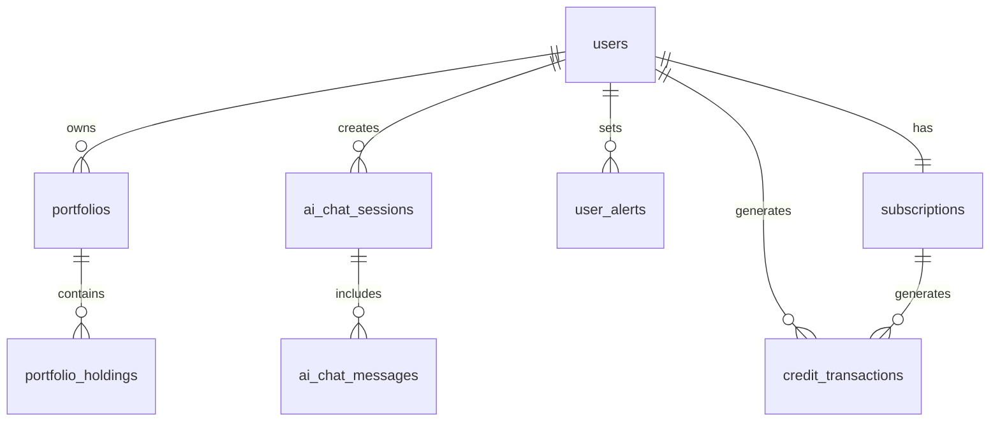

# Database Schema

## Overview

ChainWise uses Supabase PostgreSQL with Row Level Security (RLS) for secure, scalable data management. The schema supports multi-portfolio management, AI chat functionality, subscription tiers, and comprehensive analytics.

## Database Design Principles

### Security First
- **Row Level Security (RLS)** on all user data tables
- **JWT-based authentication** with automatic user isolation
- **Minimal privilege access** with service role for admin operations only

### Performance Optimized
- **Strategic indexing** for common query patterns
- **Efficient relationships** minimizing N+1 queries
- **Optimized data types** for financial calculations (DECIMAL for precision)

### Audit Trail
- **Timestamp tracking** (created_at, updated_at) on all tables
- **Soft deletes** where appropriate for data recovery
- **Transaction history** for all user actions

## Core Tables

### Users Table

**Purpose:** Core user entity with authentication, subscription, and credit management

```sql
CREATE TABLE users (
  id UUID PRIMARY KEY DEFAULT gen_random_uuid(),
  email TEXT UNIQUE NOT NULL,
  created_at TIMESTAMPTZ DEFAULT NOW(),
  updated_at TIMESTAMPTZ DEFAULT NOW(),
  subscription_tier TEXT DEFAULT 'free' CHECK (subscription_tier IN ('free', 'pro', 'elite')),
  credits_balance INTEGER DEFAULT 3,
  last_credit_refresh TIMESTAMPTZ,
  total_points INTEGER DEFAULT 0
);

-- RLS Policy
ALTER TABLE users ENABLE ROW LEVEL SECURITY;
CREATE POLICY "Users can manage their own data" ON users
  FOR ALL USING (auth.uid() = id);
```

**Key Relationships:**
- One to many with Portfolio
- One to many with AiChatSession
- One to many with UserAlert
- One to one with Subscription

### Portfolios Table

**Purpose:** Container for crypto holdings with performance tracking and analytics

```sql
CREATE TABLE portfolios (
  id UUID PRIMARY KEY DEFAULT gen_random_uuid(),
  user_id UUID REFERENCES users(id) ON DELETE CASCADE,
  name TEXT NOT NULL,
  description TEXT,
  is_default BOOLEAN DEFAULT FALSE,
  total_value_usd DECIMAL(20,8) DEFAULT 0,
  total_cost_usd DECIMAL(20,8) DEFAULT 0,
  created_at TIMESTAMPTZ DEFAULT NOW(),
  updated_at TIMESTAMPTZ DEFAULT NOW(),
  last_updated TIMESTAMPTZ DEFAULT NOW(),
  deleted_at TIMESTAMPTZ
);

-- Indexes
CREATE INDEX idx_portfolios_user_id ON portfolios(user_id);
CREATE INDEX idx_portfolios_active ON portfolios(user_id) WHERE deleted_at IS NULL;

-- RLS Policy
ALTER TABLE portfolios ENABLE ROW LEVEL SECURITY;
CREATE POLICY "Users can manage their own portfolios" ON portfolios
  FOR ALL USING (auth.uid() = user_id);
```

**Key Relationships:**
- Many to one with User
- One to many with PortfolioHolding

### Portfolio Holdings Table

**Purpose:** Individual cryptocurrency positions within portfolios with purchase tracking

```sql
CREATE TABLE portfolio_holdings (
  id UUID PRIMARY KEY DEFAULT gen_random_uuid(),
  portfolio_id UUID REFERENCES portfolios(id) ON DELETE CASCADE,
  crypto_id TEXT NOT NULL,
  symbol TEXT NOT NULL,
  name TEXT,
  amount DECIMAL(20,8) NOT NULL,
  average_purchase_price_usd DECIMAL(20,8),
  current_price_usd DECIMAL(20,8),
  current_value_usd DECIMAL(20,8),
  cost_basis_usd DECIMAL(20,8),
  profit_loss_usd DECIMAL(20,8),
  profit_loss_percentage DECIMAL(10,4),
  first_purchase_date TIMESTAMPTZ,
  created_at TIMESTAMPTZ DEFAULT NOW(),
  updated_at TIMESTAMPTZ DEFAULT NOW(),
  last_updated TIMESTAMPTZ DEFAULT NOW()
);

-- Indexes
CREATE INDEX idx_portfolio_holdings_portfolio_id ON portfolio_holdings(portfolio_id);
CREATE INDEX idx_portfolio_holdings_crypto_id ON portfolio_holdings(crypto_id);

-- RLS Policy
ALTER TABLE portfolio_holdings ENABLE ROW LEVEL SECURITY;
CREATE POLICY "Users can manage their own holdings" ON portfolio_holdings
  FOR ALL USING (auth.uid() = (SELECT user_id FROM portfolios WHERE id = portfolio_id));
```

**Key Relationships:**
- Many to one with Portfolio

## AI Chat System Tables

### AI Chat Sessions Table

**Purpose:** AI conversation sessions with persona tracking and credit usage

```sql
CREATE TABLE ai_chat_sessions (
  id UUID PRIMARY KEY DEFAULT gen_random_uuid(),
  user_id UUID REFERENCES users(id) ON DELETE CASCADE,
  persona TEXT CHECK (persona IN ('buddy', 'professor', 'trader')),
  title TEXT,
  is_active BOOLEAN DEFAULT TRUE,
  created_at TIMESTAMPTZ DEFAULT NOW(),
  updated_at TIMESTAMPTZ DEFAULT NOW()
);

-- Indexes
CREATE INDEX idx_ai_chat_sessions_user_id ON ai_chat_sessions(user_id);
CREATE INDEX idx_ai_chat_sessions_active ON ai_chat_sessions(user_id, is_active);

-- RLS Policy
ALTER TABLE ai_chat_sessions ENABLE ROW LEVEL SECURITY;
CREATE POLICY "Users can manage their own chat sessions" ON ai_chat_sessions
  FOR ALL USING (auth.uid() = user_id);
```

### AI Chat Messages Table

**Purpose:** Individual messages within chat sessions with credit tracking

```sql
CREATE TABLE ai_chat_messages (
  id UUID PRIMARY KEY DEFAULT gen_random_uuid(),
  session_id UUID REFERENCES ai_chat_sessions(id) ON DELETE CASCADE,
  role TEXT CHECK (role IN ('user', 'assistant')),
  content TEXT NOT NULL,
  credits_used INTEGER DEFAULT 0,
  metadata JSONB,
  created_at TIMESTAMPTZ DEFAULT NOW()
);

-- Indexes
CREATE INDEX idx_ai_chat_messages_session_id ON ai_chat_messages(session_id);
CREATE INDEX idx_ai_chat_messages_created_at ON ai_chat_messages(created_at);

-- RLS Policy
ALTER TABLE ai_chat_messages ENABLE ROW LEVEL SECURITY;
CREATE POLICY "Users can access their own messages" ON ai_chat_messages
  FOR ALL USING (auth.uid() = (SELECT user_id FROM ai_chat_sessions WHERE id = session_id));
```

## Subscription and Payment Tables

### Subscriptions Table

**Purpose:** Stripe subscription management and billing tracking

```sql
CREATE TABLE subscriptions (
  id UUID PRIMARY KEY DEFAULT gen_random_uuid(),
  user_id UUID REFERENCES users(id) ON DELETE CASCADE,
  stripe_subscription_id TEXT UNIQUE,
  stripe_customer_id TEXT,
  tier TEXT NOT NULL CHECK (tier IN ('free', 'pro', 'elite')),
  status TEXT NOT NULL CHECK (status IN ('active', 'canceled', 'past_due', 'unpaid')),
  current_period_start TIMESTAMPTZ,
  current_period_end TIMESTAMPTZ,
  canceled_at TIMESTAMPTZ,
  cancel_at_period_end BOOLEAN DEFAULT FALSE,
  price_id TEXT,
  trial_start TIMESTAMPTZ,
  trial_end TIMESTAMPTZ,
  metadata JSONB,
  created_at TIMESTAMPTZ DEFAULT NOW(),
  updated_at TIMESTAMPTZ DEFAULT NOW()
);

-- Indexes
CREATE INDEX idx_subscriptions_user_id ON subscriptions(user_id);
CREATE INDEX idx_subscriptions_stripe_id ON subscriptions(stripe_subscription_id);
CREATE INDEX idx_subscriptions_status ON subscriptions(status);

-- RLS Policy
ALTER TABLE subscriptions ENABLE ROW LEVEL SECURITY;
CREATE POLICY "Users can view their own subscriptions" ON subscriptions
  FOR SELECT USING (auth.uid() = user_id);
```

### Credit Transactions Table

**Purpose:** Audit trail for AI credit usage and allocation

```sql
CREATE TABLE credit_transactions (
  id UUID PRIMARY KEY DEFAULT gen_random_uuid(),
  user_id UUID REFERENCES users(id) ON DELETE CASCADE,
  transaction_type TEXT CHECK (transaction_type IN ('allocation', 'usage', 'bonus')),
  amount INTEGER NOT NULL,
  description TEXT,
  feature_used TEXT,
  metadata JSONB,
  created_at TIMESTAMPTZ DEFAULT NOW()
);

-- Indexes
CREATE INDEX idx_credit_transactions_user_id ON credit_transactions(user_id);
CREATE INDEX idx_credit_transactions_type ON credit_transactions(transaction_type);
CREATE INDEX idx_credit_transactions_created_at ON credit_transactions(created_at);

-- RLS Policy
ALTER TABLE credit_transactions ENABLE ROW LEVEL SECURITY;
CREATE POLICY "Users can view their own credit transactions" ON credit_transactions
  FOR SELECT USING (auth.uid() = user_id);
```

## Alert and Notification Tables

### User Alerts Table

**Purpose:** Price monitoring alerts with notification preferences and trigger tracking

```sql
CREATE TABLE user_alerts (
  id UUID PRIMARY KEY DEFAULT gen_random_uuid(),
  user_id UUID REFERENCES users(id) ON DELETE CASCADE,
  crypto_id TEXT NOT NULL,
  symbol TEXT NOT NULL,
  alert_type TEXT CHECK (alert_type IN ('price_above', 'price_below', 'percent_change')),
  target_price DECIMAL(20,8),
  percentage_threshold DECIMAL(10,4),
  notification_method TEXT DEFAULT 'both' CHECK (notification_method IN ('email', 'in_app', 'both')),
  is_active BOOLEAN DEFAULT TRUE,
  is_triggered BOOLEAN DEFAULT FALSE,
  triggered_at TIMESTAMPTZ,
  message TEXT,
  created_at TIMESTAMPTZ DEFAULT NOW(),
  updated_at TIMESTAMPTZ DEFAULT NOW()
);

-- Indexes
CREATE INDEX idx_user_alerts_user_id ON user_alerts(user_id);
CREATE INDEX idx_user_alerts_active ON user_alerts(is_active) WHERE is_active = TRUE;
CREATE INDEX idx_user_alerts_crypto ON user_alerts(crypto_id, is_active);

-- RLS Policy
ALTER TABLE user_alerts ENABLE ROW LEVEL SECURITY;
CREATE POLICY "Users can manage their own alerts" ON user_alerts
  FOR ALL USING (auth.uid() = user_id);
```

## Data Relationships

### Entity Relationship Diagram



### Key Relationships

1. **User → Portfolio** (One-to-Many)
   - Users can have multiple portfolios based on tier
   - Tier limits enforced at application level

2. **Portfolio → Holdings** (One-to-Many)
   - Each portfolio contains multiple cryptocurrency holdings
   - Holdings track cost basis and current value

3. **User → AI Sessions** (One-to-Many)
   - Users can have multiple AI chat sessions
   - Sessions group related conversations

4. **Session → Messages** (One-to-Many)
   - Each session contains user and AI messages
   - Messages track credit usage

## Database Functions and Triggers

### Automatic Timestamp Updates

```sql
-- Function to update updated_at timestamp
CREATE OR REPLACE FUNCTION update_updated_at_column()
RETURNS TRIGGER AS $$
BEGIN
    NEW.updated_at = NOW();
    RETURN NEW;
END;
$$ language 'plpgsql';

-- Apply to all relevant tables
CREATE TRIGGER update_users_updated_at BEFORE UPDATE ON users
    FOR EACH ROW EXECUTE FUNCTION update_updated_at_column();

CREATE TRIGGER update_portfolios_updated_at BEFORE UPDATE ON portfolios
    FOR EACH ROW EXECUTE FUNCTION update_updated_at_column();
```

### Portfolio Value Calculation

```sql
-- Function to calculate portfolio total value
CREATE OR REPLACE FUNCTION calculate_portfolio_value(portfolio_uuid UUID)
RETURNS DECIMAL AS $$
DECLARE
    total_value DECIMAL(20,8) := 0;
BEGIN
    SELECT COALESCE(SUM(current_value_usd), 0)
    INTO total_value
    FROM portfolio_holdings
    WHERE portfolio_id = portfolio_uuid;

    UPDATE portfolios
    SET total_value_usd = total_value,
        last_updated = NOW()
    WHERE id = portfolio_uuid;

    RETURN total_value;
END;
$$ LANGUAGE plpgsql;
```

### Credit Balance Management

```sql
-- Function to deduct credits with validation
CREATE OR REPLACE FUNCTION deduct_credits(user_uuid UUID, amount INTEGER, description TEXT)
RETURNS BOOLEAN AS $$
DECLARE
    current_balance INTEGER;
BEGIN
    -- Get current balance
    SELECT credits_balance INTO current_balance
    FROM users
    WHERE id = user_uuid;

    -- Check if sufficient credits
    IF current_balance < amount THEN
        RETURN FALSE;
    END IF;

    -- Deduct credits
    UPDATE users
    SET credits_balance = credits_balance - amount
    WHERE id = user_uuid;

    -- Log transaction
    INSERT INTO credit_transactions (user_id, transaction_type, amount, description)
    VALUES (user_uuid, 'usage', -amount, description);

    RETURN TRUE;
END;
$$ LANGUAGE plpgsql;
```

## Performance Optimization

### Query Optimization Strategies

1. **Composite Indexes**
   ```sql
   CREATE INDEX idx_portfolio_user_active ON portfolios(user_id, deleted_at)
   WHERE deleted_at IS NULL;
   ```

2. **Partial Indexes**
   ```sql
   CREATE INDEX idx_alerts_active_monitoring ON user_alerts(crypto_id, target_price)
   WHERE is_active = TRUE AND is_triggered = FALSE;
   ```

3. **Foreign Key Indexes**
   ```sql
   -- Automatically created for foreign keys, but explicit for clarity
   CREATE INDEX idx_holdings_portfolio_lookup ON portfolio_holdings(portfolio_id);
   ```

### Real-time Optimization

```sql
-- Enable real-time for critical tables
ALTER TABLE portfolios REPLICA IDENTITY FULL;
ALTER TABLE portfolio_holdings REPLICA IDENTITY FULL;
ALTER TABLE ai_chat_messages REPLICA IDENTITY FULL;
```

## Data Migration Scripts

### Initial Data Setup

```sql
-- Create default portfolio for existing users
INSERT INTO portfolios (user_id, name, description, is_default)
SELECT id, 'My Portfolio', 'Default portfolio', TRUE
FROM users
WHERE NOT EXISTS (
    SELECT 1 FROM portfolios WHERE portfolios.user_id = users.id
);
```

### Credit Allocation

```sql
-- Allocate credits based on subscription tier
UPDATE users SET
    credits_balance = CASE subscription_tier
        WHEN 'free' THEN 3
        WHEN 'pro' THEN 50
        WHEN 'elite' THEN 200
        ELSE 3
    END,
    last_credit_refresh = NOW()
WHERE last_credit_refresh IS NULL;
```

## Backup and Recovery

### Backup Strategy
- **Automated daily backups** via Supabase
- **Point-in-time recovery** up to 7 days (Pro plan)
- **Cross-region replication** for disaster recovery

### Data Retention Policies
- **User data:** Retained indefinitely while account active
- **Chat messages:** Retained for 2 years for Elite, 6 months for Pro/Free
- **Transaction logs:** Retained for 7 years for compliance
- **Deleted accounts:** Data purged after 30-day grace period

This database schema provides a robust foundation for ChainWise's crypto portfolio management platform with proper security, performance, and scalability considerations.