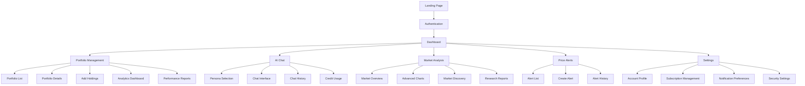
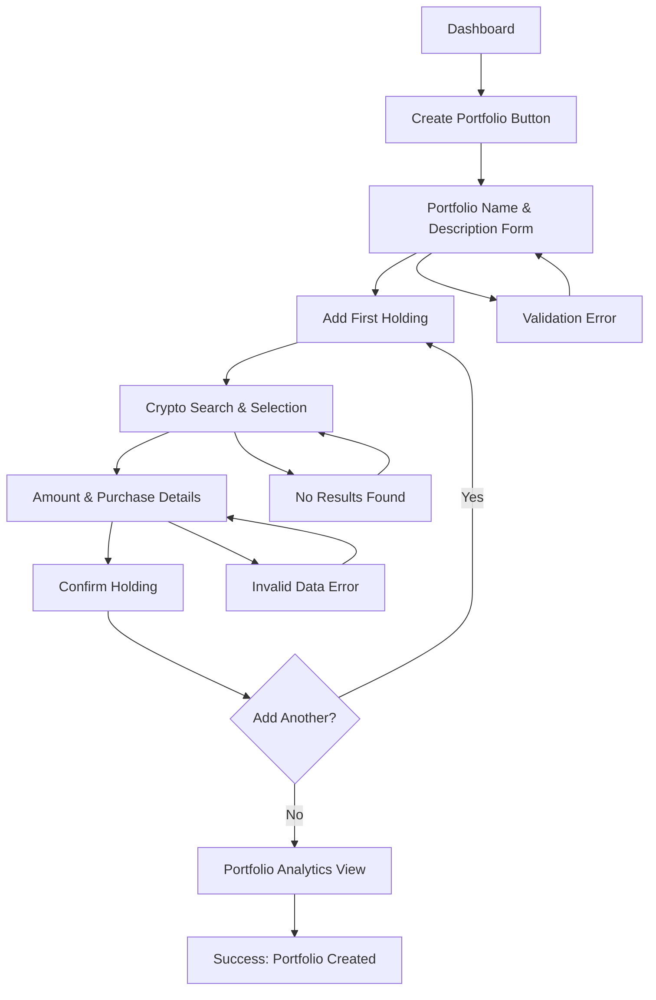
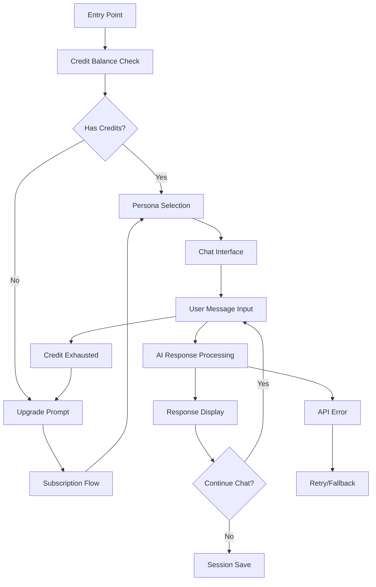
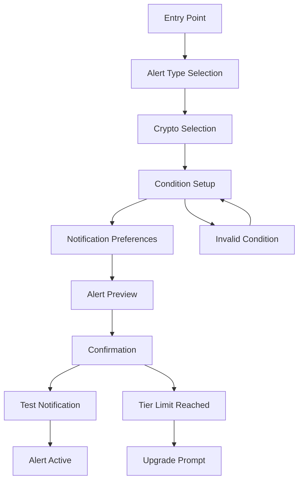

# ChainWise UI/UX Specification

## Introduction

This document defines the user experience goals, information architecture, user flows, and visual design specifications for ChainWise's user interface. It serves as the foundation for visual design and frontend development, ensuring a cohesive and user-centered experience for sophisticated crypto investors.

### Overall UX Goals & Principles

#### Target User Personas

**Sophisticated Retail Crypto Investor (Primary)**
- Age: 25-45, tech-savvy professionals with $75K-$300K income
- Crypto portfolio: $10K-$500K, 2+ years experience
- Uses multiple tools currently (CoinGecko, spreadsheets, Discord)
- Wants professional-grade analytics in accessible format
- Values efficiency and advanced insights over hand-holding

**Small Crypto Fund Manager (Secondary)**
- AUM: $1M-$50M, 1-5 investment professionals
- Needs institutional analytics without institutional complexity
- Requires client reporting and professional presentation
- Values comprehensive risk management and portfolio optimization

**Crypto Learning Enthusiast (Tertiary)**
- New to advanced investing but eager to learn
- Appreciates educational guidance from AI personas
- Wants to grow from basic tracking to sophisticated analysis
- Needs progressive feature disclosure and learning support

#### Usability Goals

- **Immediate Value**: Users see portfolio insights within 30 seconds of login
- **Learning Efficiency**: New users complete portfolio setup and see analytics within 5 minutes
- **Expert Efficiency**: Power users access advanced features with maximum 2 clicks
- **Mobile Excellence**: All core functions work seamlessly on mobile devices
- **AI Integration**: Users feel confident engaging with AI personas for investment guidance
- **Error Prevention**: Clear validation prevents costly mistakes in portfolio data entry

#### Design Principles

1. **Sophisticated Simplicity** - Professional appearance without overwhelming complexity
2. **Progressive Disclosure** - Advanced features discoverable but not cluttering basic workflows
3. **Data-Driven Beauty** - Make complex financial data visually appealing and understandable
4. **Responsive Intelligence** - Interface adapts to user experience level and device capabilities
5. **Trust Through Transparency** - Clear data sources, calculation methods, and AI reasoning

### Change Log
| Date | Version | Description | Author |
|------|---------|-------------|---------|
| 2024-09-18 | 1.0 | Initial UI/UX specification creation | Sally (UX Expert) |

## Information Architecture (IA)

### Site Map / Screen Inventory

### Navigation Structure

**Primary Navigation:** Purple-themed collapsible sidebar for dashboard area with distinct sections:
- Dashboard (home icon with real-time portfolio value)
- Portfolios (briefcase icon with portfolio count)
- AI Assistant (brain icon with credit balance indicator)
- Market Analysis (trending icon with live market indicator)
- Alerts (bell icon with active alert count)
- Settings (gear icon)

**Secondary Navigation:** Top navigation bar for non-dashboard pages (landing, auth, help) with:
- Logo/brand navigation
- Authentication state indicator
- Subscription tier badge
- User profile dropdown

**Breadcrumb Strategy:** Used only in deep portfolio analysis and settings sections to prevent user disorientation in complex data views.

## User Flows

### Portfolio Creation & Setup Flow

**User Goal:** Create first portfolio and add initial holdings to see analytics

**Entry Points:**
- Dashboard "Create Portfolio" CTA
- Onboarding flow for new users
- Empty state in Portfolio section

**Success Criteria:** User has portfolio with 2+ holdings and can see basic analytics

#### Flow Diagram

#### Edge Cases & Error Handling:
- Duplicate portfolio names: Show suggested alternatives
- Invalid crypto symbol: Provide autocomplete suggestions
- Negative amounts: Clear validation message with positive examples
- Future purchase dates: Prevent with calendar constraints
- API failures: Graceful degradation with retry options

**Notes:** Focus on single portfolio creation initially, with clear upgrade prompts for multi-portfolio features.

### AI Chat Interaction Flow

**User Goal:** Get personalized investment advice through AI chat

**Entry Points:**
- Dashboard AI chat widget
- Dedicated AI Assistant page
- Contextual help throughout platform

**Success Criteria:** User completes meaningful conversation and finds value in AI guidance

#### Flow Diagram

#### Edge Cases & Error Handling:
- Credit exhaustion mid-conversation: Graceful upgrade prompt with conversation preservation
- API timeouts: Retry mechanism with user feedback
- Inappropriate content: Content filtering with helpful redirection
- Long response times: Typing indicators and progress feedback

**Notes:** Emphasize persona selection upfront to set user expectations for conversation style.

### Price Alert Creation Flow

**User Goal:** Set up automated alerts for important price movements

**Entry Points:**
- Alerts page "Create Alert" button
- Portfolio holding context menu
- Market analysis crypto selection

**Success Criteria:** User creates functional alert and receives test notification

#### Flow Diagram

#### Edge Cases & Error Handling:
- Duplicate alerts: Warn and suggest modifications
- Unrealistic price targets: Educational guidance on market context
- Email delivery failures: Alternative notification method setup
- Tier limit exceeded: Clear upgrade path explanation

**Notes:** Include educational content about alert types for less experienced users.

## Wireframes & Mockups

### Design Files
**Primary Design Files:** Figma workspace with comprehensive component library and responsive breakpoint designs

### Key Screen Layouts

#### Dashboard (Main Hub)

**Purpose:** Central command center showing portfolio overview, market status, and quick actions

**Key Elements:**
- Purple gradient header with user profile and subscription tier
- Portfolio value cards with gain/loss indicators and glassmorphism effects
- Market statistics rail with live crypto prices and trends
- AI chat widget with persona indicators and credit balance
- Quick action buttons (Add Holdings, Create Alert, Analyze Portfolio)
- Sidebar navigation with collapsible functionality

**Interaction Notes:** Real-time data updates, smooth transitions between sections, responsive card layouts

**Design File Reference:** Dashboard_Overview_Main.fig

#### Portfolio Analytics Deep Dive

**Purpose:** Comprehensive analytics view with advanced metrics and professional charts

**Key Elements:**
- Tabbed interface (Overview, Risk Analysis, Performance Attribution, Correlation)
- Interactive charts with Recharts integration and purple theming
- Metric cards for VaR, Sharpe Ratio, Beta with explanatory tooltips
- Asset allocation visualizations with hover interactions
- Export functionality for professional reporting

**Interaction Notes:** Chart zoom/pan capabilities, metric drill-down, responsive chart adaptation

**Design File Reference:** Portfolio_Analytics_Advanced.fig

#### AI Chat Interface

**Purpose:** Conversational interface for AI-powered investment guidance

**Key Elements:**
- Persona selection carousel with distinct visual identities
- Chat message bubbles with typing indicators and timestamps
- Context panel showing relevant portfolio data
- Credit usage meter with subscription upgrade prompts
- Message history search and filtering

**Interaction Notes:** Smooth scrolling, real-time message delivery, contextual data integration

**Design File Reference:** AI_Chat_Interface.fig

#### Mobile Dashboard

**Purpose:** Touch-optimized dashboard for mobile portfolio management

**Key Elements:**
- Collapsible navigation drawer with gesture support
- Swipeable portfolio cards with pull-to-refresh
- Bottom navigation for core functions
- Touch-friendly charts with pinch-to-zoom
- Simplified AI chat with voice input option

**Interaction Notes:** Touch gestures, mobile-specific animations, optimized load times

**Design File Reference:** Mobile_Dashboard_Responsive.fig

## Component Library / Design System

### Design System Approach
**Design System Approach:** Custom design system built on shadcn/ui foundation with purple glassmorphism theme, optimized for financial data visualization and crypto trading interfaces.

### Core Components

#### GlassmorphismCard

**Purpose:** Primary container component with frosted glass effect for displaying financial data and controls

**Variants:**
- Default (white/transparent)
- Primary (purple gradient)
- Success (green accent)
- Warning (amber accent)
- Error (red accent)

**States:** Default, Hover, Focus, Loading, Disabled

**Usage Guidelines:** Use for all major content containers, maintain consistent padding and border radius across variants

#### PurpleButton

**Purpose:** Primary action component with purple gradient styling and multiple interaction states

**Variants:**
- Primary (purple gradient)
- Secondary (purple outline)
- Ghost (transparent)
- Destructive (red gradient)

**States:** Default, Hover, Active, Loading, Disabled

**Usage Guidelines:** Primary for main actions, Secondary for secondary actions, maintain accessibility contrast ratios

#### CryptoSearchInput

**Purpose:** Specialized input component for cryptocurrency selection with autocomplete functionality

**Variants:**
- Standard
- Compact (for mobile)
- Multi-select (for portfolio creation)

**States:** Default, Focus, Loading, Error, Success

**Usage Guidelines:** Always include crypto icons, maintain real-time search functionality, handle API loading states

#### MetricCard

**Purpose:** Display component for financial metrics with visual indicators and educational tooltips

**Variants:**
- Basic metric (single value)
- Comparison metric (current vs previous)
- Trend metric (with chart integration)
- Risk metric (with color coding)

**States:** Default, Loading, Error, No Data

**Usage Guidelines:** Consistent typography scaling, color-coded risk indicators, accessible tooltip interactions

#### PortfolioChart

**Purpose:** Interactive chart component for displaying portfolio and market data

**Variants:**
- Line chart (price trends)
- Area chart (portfolio value)
- Pie chart (asset allocation)
- Correlation heatmap

**States:** Default, Loading, Interactive, No Data

**Usage Guidelines:** Consistent purple theming, responsive scaling, accessible data table alternatives

## Branding & Style Guide

### Visual Identity
**Brand Guidelines:** ChainWise premium fintech brand focusing on sophisticated purple glassmorphism aesthetic with professional crypto trading credibility

### Color Palette

| Color Type | Hex Code | Usage |
|------------|----------|-------|
| Primary | #6B46C1 | Main brand color, primary buttons, key accents |
| Secondary | #7C3AED | Gradient transitions, hover states, secondary elements |
| Accent | #A855F7 | Highlights, active states, call-to-action elements |
| Success | #10B981 | Positive returns, confirmations, success messages |
| Warning | #F59E0B | Cautions, important notices, risk indicators |
| Error | #EF4444 | Errors, destructive actions, severe risk warnings |
| Neutral | #64748B, #94A3B8, #CBD5E1 | Text, borders, background elements |

### Typography

#### Font Families
- **Primary:** Inter (web-optimized, excellent readability for financial data)
- **Secondary:** JetBrains Mono (monospace for prices, addresses, technical data)
- **Display:** Inter Display (for large headlines and brand elements)

#### Type Scale

| Element | Size | Weight | Line Height |
|---------|------|--------|-------------|
| H1 | 3rem (48px) | 700 | 1.2 |
| H2 | 2.25rem (36px) | 600 | 1.3 |
| H3 | 1.875rem (30px) | 600 | 1.4 |
| Body | 1rem (16px) | 400 | 1.6 |
| Small | 0.875rem (14px) | 400 | 1.5 |

### Iconography

**Icon Library:** Lucide React icons with custom crypto-specific icons for major cryptocurrencies

**Usage Guidelines:**
- Consistent sizing (16px, 20px, 24px standard sizes)
- Purple theming for interactive icons
- Neutral colors for informational icons
- Accessible alternative text for all icons

### Spacing & Layout

**Grid System:** 12-column responsive grid with 24px gutters on desktop, 16px on mobile

**Spacing Scale:** 4px base unit progression (4, 8, 12, 16, 24, 32, 48, 64, 96px)

## Accessibility Requirements

### Compliance Target
**Standard:** WCAG AA compliance with specific enhancements for financial data accessibility

### Key Requirements

**Visual:**
- Color contrast ratios: 4.5:1 minimum for normal text, 3:1 for large text
- Focus indicators: Visible 2px purple outline with 2px offset on all interactive elements
- Text sizing: Scalable to 200% without horizontal scrolling

**Interaction:**
- Keyboard navigation: Full functionality accessible via keyboard with logical tab order
- Screen reader support: Comprehensive ARIA labels, landmarks, and live regions for data updates
- Touch targets: Minimum 44px touch targets for mobile interactions

**Content:**
- Alternative text: Descriptive alt text for all charts and visual data representations
- Heading structure: Logical hierarchy with proper h1-h6 usage
- Form labels: Clear, descriptive labels for all form inputs with error messaging

### Testing Strategy
Automated accessibility testing with axe-core integration, manual keyboard navigation testing, screen reader validation with NVDA/JAWS, and user testing with accessibility specialists.

## Responsiveness Strategy

### Breakpoints

| Breakpoint | Min Width | Max Width | Target Devices |
|------------|-----------|-----------|----------------|
| Mobile | 320px | 768px | iPhone, Android phones, small tablets |
| Tablet | 768px | 1024px | iPad, Android tablets, small laptops |
| Desktop | 1024px | 1440px | Standard monitors, laptops |
| Wide | 1440px | - | Large monitors, ultrawide displays |

### Adaptation Patterns

**Layout Changes:**
- Mobile: Single column layout with stacked components
- Tablet: Two-column layout with collapsible sidebar
- Desktop: Full sidebar with multi-column content areas
- Wide: Additional data columns and expanded chart areas

**Navigation Changes:**
- Mobile: Bottom tab navigation with hamburger menu
- Tablet: Collapsible sidebar with touch gestures
- Desktop: Full sidebar with hover interactions
- Wide: Persistent sidebar with additional quick actions

**Content Priority:**
- Mobile: Portfolio value, quick actions, essential metrics only
- Tablet: Add market overview and recent activity
- Desktop: Full analytics dashboard with comprehensive data
- Wide: Enhanced charts and additional market intelligence

**Interaction Changes:**
- Mobile: Touch-first interactions, swipe gestures, simplified forms
- Tablet: Mixed touch/mouse support, adaptive input methods
- Desktop: Mouse-optimized with keyboard shortcuts
- Wide: Advanced hotkeys and multi-window support

## Animation & Micro-interactions

### Motion Principles
Purposeful motion that enhances usability without distracting from financial data analysis. Smooth, professional animations with consistent easing and duration that respect user preferences for reduced motion.

### Key Animations
- **Card Hover Effects:** Subtle scale (1.02x) and shadow enhancement (Duration: 200ms, Easing: ease-out)
- **Loading States:** Shimmer effects for data loading with purple gradient (Duration: 1.5s loop, Easing: ease-in-out)
- **Data Updates:** Smooth number transitions with highlight flash (Duration: 300ms, Easing: ease-in-out)
- **Navigation Transitions:** Sidebar slide and fade effects (Duration: 250ms, Easing: cubic-bezier(0.4, 0, 0.2, 1))
- **Success Feedback:** Scale pulse on successful actions (Duration: 150ms, Easing: ease-out)
- **Chart Interactions:** Smooth zoom and pan with momentum (Duration: Variable, Easing: ease-out)

## Performance Considerations

### Performance Goals
- **Page Load:** <2 seconds initial load, <1 second subsequent navigation
- **Interaction Response:** <100ms for UI interactions, <500ms for data updates
- **Animation FPS:** 60fps for all animations and chart interactions

### Design Strategies
**Image Optimization:** WebP format with fallbacks, responsive images, lazy loading for non-critical content
**Component Loading:** Progressive enhancement with skeleton screens, critical path prioritization
**Data Visualization:** Efficient chart rendering with virtualization for large datasets, progressive data loading
**Asset Strategy:** CSS/JS minification, font optimization, critical CSS inlining

## Next Steps

### Immediate Actions
1. Create detailed Figma designs for all core screens with responsive breakpoints
2. Build comprehensive component library with purple glassmorphism theme
3. Develop interactive prototypes for user flow validation
4. Conduct usability testing with target crypto investor personas
5. Validate accessibility compliance with automated and manual testing
6. Optimize design assets for development handoff

### Design Handoff Checklist
- [x] All user flows documented with edge cases
- [x] Component inventory complete with variants and states
- [x] Accessibility requirements defined with testing strategy
- [x] Responsive strategy clear with specific breakpoints
- [x] Brand guidelines incorporated with purple glassmorphism theme
- [x] Performance goals established with optimization strategies

## Checklist Results
UI/UX specification completed successfully with comprehensive coverage of user experience goals, information architecture, visual design system, and technical requirements. Ready for architect review and development implementation.